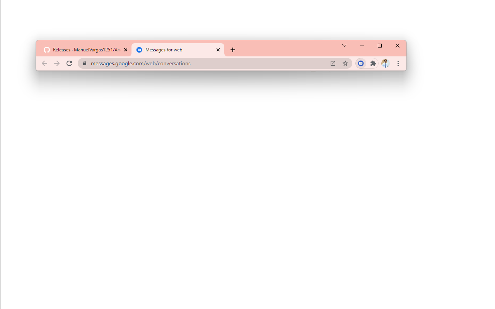

# Menu Icon for Android Messages Chrome Extension 🌎

This chrome extension adds a google messages icon to your chrome extensions bar. When clicked, a new tab is loaded to messages.google.com from your browser!

You can now view your text messages from the Messages app from Google on your chrome browser! 

## [Download from Chrome Web Store](https://chrome.google.com/webstore/detail/odhjnjgngaofbpdfdmcmdfenohncgopl)

Please submit issues for any bugs/features.

I have no association with Google or any other related entity.

